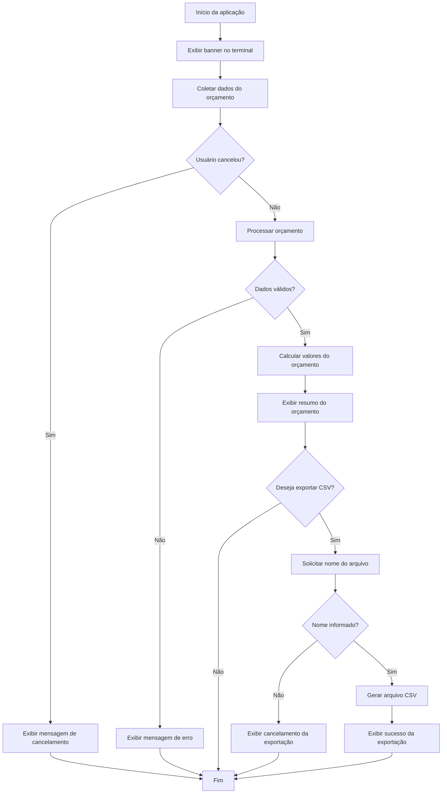

# Fluxograma da aplicação

```mermaid
flowchart TD
    A[Início da aplicação] --> B[Exibir banner no terminal]
    B --> C[Coletar dados do orçamento]

    C --> D{Usuário cancelou?}
    D -- Sim --> E[Exibir mensagem de cancelamento]
    E --> F[Fim]

    D -- Não --> G[Processar orçamento]
    G --> H{Dados válidos?}

    H -- Não --> I[Exibir mensagem de erro]
    I --> F

    H -- Sim --> J[Calcular valores do orçamento]
    J --> K[Exibir resumo do orçamento]
    K --> L{Deseja exportar CSV?}

    L -- Não --> F
    L -- Sim --> M[Solicitar nome do arquivo]
    M --> N{Nome informado?}

    N -- Não --> O[Exibir cancelamento da exportação]
    O --> F

    N -- Sim --> P[Gerar arquivo CSV]
    P --> Q[Exibir sucesso da exportação]
    Q --> F
```
